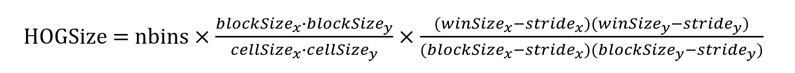
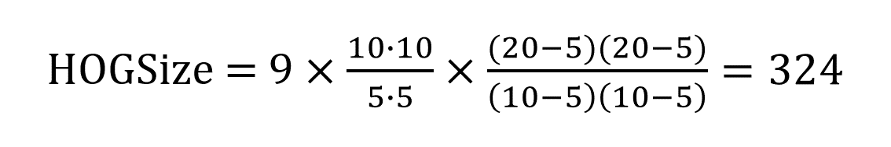
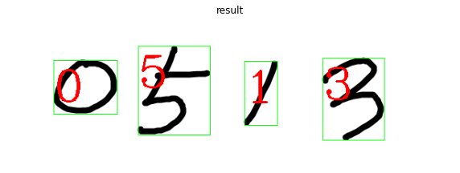

https://dacon.io/codeshare/5179

[opencv : haarcascades pre trainning](https://github.com/opencv/opencv/tree/4.x/data/haarcascades)


목차
5. HOG 디스크립터
6. BOW
7. 케스케이드 분류기


## 5. HOG 디스크립터

- HOG(Histogram of Oriented Gradient)보행자 검출을 목적으로 만들어진 특징 디스크립터 중 하나로 엣지의 기울기 방향과 규모를 히스토그램입니다.

- SIFT, SURF, ORB 등과 같은 특징 디스크립터들은 특징점 하나하나에 대해서 서술하고 있어서 객체의 지역적 특성을 표현하는 데에 뛰어나지만, 전체적인 모양을 특징으로 표현하기는 어렵습니다. 그에 반해서, HOG는 지역적인 특징보다는 전체적인 모양을 표현하기에 적합합니다.

- HOG는 대상 객체의 상태나 자세가 약간 다르더라도 그 특징을 일반화해서 같은 객체로 인식하는 것이 특징입니다.

## 5.1 HOG 디스크립터 제작
- window : HOG 디스크립터를 만들기 위해서 전체 이미지에서 인식하고자 하는 영역을 잘라냅니다.(크기는 인식할 객체의 크기를 담을 수 있는 정도) 이때, 객체가 너무 작거나 크면 확대하거나 축소해야 하지만 원래의 비율을 유지해야 합니다.
- 보행자를 검출할 때는 사람이 세로로 긴 형태이므로 64*128 크기로 하는 것이 일반적입니다. 잘라낸 영역을 소벨 필터를 이용해서 엣지의 기울기 gx, gy를 구하고, 기울기의 방향과 크기를 계산합니다.

```python
import cv2
import numpy as np
img = cv2.imread("img.jpg")
# img = np.float(img)

gx = cv2.Sobel(img, cv2.CV_32F, 1, 0)
gy = cv2.Sobel(img, cv2.CV_32F, 0, 1)
magnitude, angle = cv2.cartToPolar(gx, gy)
```

- 엣지의 경사도에 대해서 히스토그램을 계산합니다.

- 셀(cell) : 윈도 전체를 하나의 히스토그램으로 계산하는 것이 아니라 작은 영역으로 다시 나누어서 히스토그램을 계산합니다. 셀의 크기는 경험적으로 구해야 하지만, 보행자 검출에서는 흔히 8*8 크기의 셀로 나눕니다.

- 한 셀의 엣지 기울기 값으로 히스토그램을 계산하는 데 기울기의 방향을 계급(bin)으로 하고 기울기의 크기를 값으로 누적하는 방식입니다. 계급은 180도를 20도씩 구간을 나뉘어 9개의 계급을 사용하는 것이 일반적입니다. 이때, 360도가 아닌 180도인 이유는 기울기는 양수와 음수가 같은 방향을 나타내기 때문입니다.

- 히스토그램 계산을 마치고 나면 다시 노멀라이즈 과정이 필요합니다.

- 엣지 기울기는 전체 밝기에 민감하므로 주변 픽셀과의 차이를 고려해서 민감성을 제거하는 과정입니다.

- 블록(block) : 노멀라이즈를 위해서는 다시 한번 윈도우를 잘게 나눠줍니다. 블록의 크기는 흔히 셀 크기의 2배로 하는 것이 일반적입니다. 예로, 8x8 크기의 셀인 경우 16x16으로 볼 수 있고 36x1 크기의 벡터로 표현합니다.

- 각 블록은 셀들을 순차적으로 이동하면서 노멀라이즈하는데, 이때 겹치는 부분을 블록 스트라이드(block stride)라고 합니다. 64x128 윈도우에 16x16 크기의 블록이 8x8만큼 겹치면서 계산할 경우, 경우의 수는 7x15=105입니다.

디스크립터의 크기 계산 공식



- 최종적인 HOG 디스크립터의 크기는 105x36 = 3780입니다.
- OpenCV는 HOG 디스크립터를 계산하기 위해 이와 같은 절차를 구현한 API를 제공합니다.
- descriptor = cv2.HOGDescriptor(winSize, blockSize, blockStride, cellSize, nbins):HOG 디스크립터 추출기 생성

- winSize : 윈도우 크기, HOG 추출 영역
- blockSize : 블록 크기, 정규화 영역
- blockStride : 정규화 블록 겹침 크기
- cellSize : 셀 크기, 히스토그램 계산 영역
- nbins : 히스토그램 계급 수
- descriptor : HOG 특징 디스크립터 추출기
hog = descriptor.compute(img) : HOG 계산

- img : 계산 대상 이미지
- hog : HOG 특징 디스크립터 결과

예시로 MNIST 손글씨 데이터를 HOG 디스크립터로 표현해서 이것을 SVM으로 훈련하는 코드를 구현해보겠습니다.

```python
import numpy as np, cv2

data = None  # 이미지 데이타 셋 
k = list(range(10)) # [0,1,2,3,4,5,6,7,8,9] 레이블 셋

# 이미지 데이타 읽어들이는 함수 
def load():
    global data
    # 0~9 각각 500(5x100)개, 총5000(50x100)개, 한 숫자당 400(20x20)픽셀
    image = cv2.imread('./img/digits.png')
    gray = cv2.cvtColor(image,cv2.COLOR_BGR2GRAY)
    # 숫자 한개(20x20)씩 구분하기 위해 행별(50)로 나누고 열별(100)로 나누기
    cells = [np.hsplit(row,100) for row in np.vsplit(gray,50)]
    # 리스트를 NumPy 배열로  변환 (50 x 100 x 20 x 20 )
    data = np.array(cells)

# 모든 숫자 데이타 반환 
def getData(reshape=True):
    if data is None: load() # 이미지 읽기 확인
    # 모든 데이타를 N x 400 형태로 변환
    if reshape:
        full = data.reshape(-1, 400).astype(np.float32) # 5000x400
    else:
        full = data
    labels = np.repeat(k,500).reshape(-1,1)  # 각 숫자당 500번 반복(10x500)
    return (full, labels)

# 훈련용 데이타 반환 
def getTrain(reshape=True):
    if data is None: load() # 이미지 읽기 확인
    # 50x100 중에 90열만 훈련 데이타로 사용
    train = data[:,:90]
    if reshape:
        # 훈련 데이타를 N X 400으로 변환
        train = train.reshape(-1,400).astype(np.float32) # 4500x400
    # 레이블 생성
    train_labels = np.repeat(k,450).reshape(-1,1) # 각 숫자당 45번 반복(10x450)
    return (train, train_labels)

# 테스트용 데이타 반환 
def getTest(reshape=True):
    if data is None: load()
    # 50x100 중에 마지막 10열만 훈련 데이타로 사용
    test = data[:,90:100]
    # 테스트 데이타를 N x 400으로 변환
    if reshape:
        test = test.reshape(-1,400).astype(np.float32) # 500x400
    test_labels = np.repeat(k,50).reshape(-1,1)
    return (test, test_labels)


# 손글씨 숫자 한 개를 20x20 로 변환후에 1x400 형태로 변환 
def digit2data(src, reshape=True):
    h, w = src.shape[:2]
    square = src
    # 정사각형 형태로 만들기
    if h > w:
        pad = (h - w)//2
        square = np.zeros((h, h), dtype=np.uint8)
        square[:, pad:pad+w] = src
    elif w > h :
        pad = (w - h)//2
        square = np.zeros((w, w), dtype=np.uint8)
        square[pad:pad+h, :] = src
    # 0으로 채워진 20x20 이미지 생성
    px20 = np.zeros((20,20), np.uint8)
    # 원본을 16x16으로 축소해서 테두리 2픽셀 확보
    px20[2:18, 2:18] = cv2.resize(square, (16,16), interpolation=cv2.INTER_AREA)
    if reshape:
        # 1x400형태로 변환
        px20 = px20.reshape((1,400)).astype(np.float32)
    return px20

```

```python
import cv2 
import numpy as np
import time

# 기울어진 숫자를 바로 세우기 위한 함수 
affine_flags = cv2.WARP_INVERSE_MAP|cv2.INTER_LINEAR
def deskew(img):
    m = cv2.moments(img)
    if abs(m['mu02']) < 1e-2:
        return img.copy()
    skew = m['mu11']/m['mu02']
    M = np.float32([[1, skew, -0.5*20*skew], [0, 1, 0]])
    img = cv2.warpAffine(img,M,(20, 20),flags=affine_flags)
    return img

# HOGDescriptor를 위한 파라미터 설정 및 생성
winSize = (20,20)
blockSize = (10,10)
blockStride = (5,5)
cellSize = (5,5)
nbins = 9
hogDesc = cv2.HOGDescriptor(winSize,blockSize,blockStride,cellSize,nbins)

if __name__ =='__main__':
    # MNIST 이미지에서 학습용 이미지와 테스트용 이미지 가져오기 
    train_data, train_label  = getTrain(reshape=False)
    test_data, test_label = getTest(reshape=False)
    # 학습 이미지 글씨 바로 세우기 
    deskewed = [list(map(deskew,row)) for row in train_data]
    # 학습 이미지 HOG 계산 ---⑤
    hogdata = [list(map(hogDesc.compute,row)) for row in deskewed]
    train_data = np.float32(hogdata)
    print('SVM training started...train data:', train_data.shape)
    # 학습용 HOG 데이타 재배열  
    train_data = train_data.reshape(-1,train_data.shape[2])
    # SVM 알고리즘 객체 생성 및 훈련 
    svm = cv2.ml.SVM_create()
    startT = time.time()
    svm.trainAuto(train_data, cv2.ml.ROW_SAMPLE, train_label)
    endT = time.time() - startT
    print('SVM training complete. %.2f Min'%(endT/60))  
    # 훈련된  결과 모델 저장 
    svm.save('svm_mnist.xml')

    # 테스트 이미지 글씨 바로 세우기 및 HOG 계산
    deskewed = [list(map(deskew,row)) for row in test_data]
    hogdata = [list(map(hogDesc.compute,row)) for row in deskewed]
    test_data = np.float32(hogdata)
    # 테스트용 HOG 데이타 재배열 
    test_data = test_data.reshape(-1,test_data.shape[2])
    # 테스트 데이타 결과 예측 
    ret, result = svm.predict(test_data)
    # 예측 결과와 테스트 레이블이 맞은 갯수 합산 및 정확도 출력
    correct = (result==test_label).sum()
    print('Accuracy: %.2f%%'%(correct*100.0/result.size))
```

- deskew() 함수는 숫자 하나의 모멘트를 계산해서 중심점을 기준으로 기울어진 숫자를 바로 세우는 역할을 합니다.

- HOG는 회전에 불변하는 디스크립터가 아니므로 손글씨가 기울어진 경우 바로 세워서 학습하기 위한 함수입니다.

- HOGDescriptor 객체를 생성하기 위한 각종 파라미터를 설정

- winSize : 20x20

- blockSize : 10x10

- cellSize : 5x5

- HOG 디스크립터의 벡터의 크기 계산 : 324




- 학습 결과를 살퍄보면 다음과 같이 시간은 꽤 걸렸지만 매우 높은 정확도를 보였습니다.
    - rain data shape : (50, 90, 324, 1)
    - train time(colab) : 21.17 Min
    - Accuracy: 98.80%

위 예시처럼 훈련과 test 과정을 거쳤다면 실제 만든 이미지를 이용하여 결과값을 도출해봅시다.

```python
import cv2
import numpy as np
import matplotlib.pyplot as plt

# 훈련해서 저장한 SVM 객체 읽기 ---① 
svm = cv2.ml.SVM_load('svm_mnist.xml')
# 인식할 손글씨 이미지 읽기 ---②
image = cv2.imread('./img/0513.png')

# 인식할 이미지를 그레이 스케일로 변환 및 스레시홀드 적용 ---③
gray = cv2.cvtColor(image,cv2.COLOR_BGR2GRAY)
gray = cv2.GaussianBlur(gray, (5, 5), 0)
_, gray = cv2.threshold(gray, 127, 255, cv2.THRESH_BINARY_INV)

# 최외곽 컨투어만 찾기 ---④
contours, _ = cv2.findContours(gray, cv2.RETR_EXTERNAL, \
                                        cv2.CHAIN_APPROX_SIMPLE)
for c in contours:
    # 컨투어를 감싸는 외접 사각형 구하기 ---⑤
    (x, y, w, h) = cv2.boundingRect(c)    
    # 외접 사각형의 크기가 너무 작은것은 제외 ---⑥
    if w >= 5 and h >= 25:
        # 숫자 영역만 roi로 확보하고 사각형 그리기 ---⑦
        roi = gray[y:y + h, x:x + w]
        cv2.rectangle(image, (x, y), (x + w, y + h), (0, 255, 0), 1)
        # 테스트 데이타 형식으로 변환 ---⑧
        px20 = digit2data(roi, False)
        # 기울어진 숫자를 바로 세우기 ---⑨
        deskewed = deskew(px20)
        # 인식할 숫자에 대한 HOG 디스크립터 계산 ---⑩
        hogdata = hogDesc.compute(deskewed)
        testData = np.float32(hogdata).reshape(-1, hogdata.shape[0])
        # 결과 예측해서 표시 ---⑪
        ret, result = svm.predict(testData)
        cv2.putText(image, "%d"%result[0], (x , y + 55), \
                        cv2.FONT_HERSHEY_COMPLEX, 2, (255, 0, 0), 2)
        
# 결과 출력
fig = plt.figure(figsize=(10, 20))
plt.subplot(111), plt.axis('off'), plt.imshow(image), plt.title("result")
plt.show()
```


- svm_mnist.xml 파일에서 모델을 로드해오고 그레이 스케일로 변환, 스레시 홀드를 적용한 - 다음, 최외곽 컨투어를 찾아서 손글씨로 쓴 숫자를 하나씩 찾아냅니다.
- 컨투어의 외접 사각형을 찾은 다음 글씨 영역만을 찾아서 해당 영역을 ROI(Region of Interest)로 설정합니다.
- 20x20로 사이즈 변경합니다.
- 기울어진 숫자를 바로 세우고 HOGDescritor 객체를 이용하여 계산합니다.
- 결과값을 살펴보면 0 5 1 3 4개의 숫자를 잘 인식한 것은 확인할 수 있습니다.


5.2 보행자 인식
HOG와 SVM을 이용해서 보행자를 인식하는 것은 간단하지만은 않습니다. 우선, 방대한 보행자 영상을 구해서 훈련을 해야합니다.

앞서 MNIST 손글씨를 학습하는 데도 긴 시간과 컴퓨팅 파워가 필요하비다 ㅠㅠ 보행자 영상은 MNIST 영상보다 크고 복잡하므로 더 오랜 시간과 컴퓨팅 파워가 필요합니다. 또한 객체 인식에서는 항상 고려되어야 하는 것이 학습한 객체와 인식하려는 객체의 크기 변화와 회전이 발생했는가 입니다.

보행자의 경우 항상 서 있는 자세이므로 회전에 대한 부분은 고려하지 않는다 하더라도 영상에 따라 크기가 달라지는 것은 고려해야합니다.

그래서 윈도 크기를 달리하면서 검출 작업을 반복 필요합니다.

OpenCV는 이와 같은 불편을 해소하기 위해 보행자 인식을 위한 미리 훈련된 API를 제공합니다.

cv2.HOGDescriptor 클래스는 단순히 HOG 디스크립터를 계산해 줄 뿐만 아니라 훈련된 SVM 모델을 전달받아 객체 인식 가능합니다. 또한 이미 훈련된 SVM 모델을 제공합니다.

svmdetector = cv2.HOGDescriptor_getDefaultPeopleDetector() : 62x128 윈도 크기로 훈련된 모델

svmdetector = cv2.HOGDescriptor_getDaimlerPeopleDetector() : 48x96 위도 크기로 훈련된 모델

desciptor = cv2.HOGDescriptor(winSize, blockSize, blockStride, cellSize, nbins) : HOG 생성

descriptor.setSVMDetector(svmdetector) : 훈련된 SVM 모델 선정

rects, weights = descriptor.detectMultiScale(img) : 객체 검출

img : 검출하고자 하는 이미지
rects : 검출된 결과 영역 좌표 N*4(x,y,w.h)
weights : 검출된 결과 개수 N*1
보행자가 지나다니고 있는 walking.avi 동영상을 이용하여 예제를 구현해봅시다.

```python
import cv2

# default 디덱터를 위한 HOG 객체 생성 및 설정
hogdef = cv2.HOGDescriptor()
hogdef.setSVMDetector(cv2.HOGDescriptor_getDefaultPeopleDetector())

# dailer 디덱터를 위한 HOG 객체 생성 및 설정
hogdaim  = cv2.HOGDescriptor((48,96), (16,16), (8,8), (8,8), 9)
hogdaim.setSVMDetector(cv2.HOGDescriptor_getDaimlerPeopleDetector())

cap = cv2.VideoCapture('./img/walking.avi')
mode = True  # 모드 변환을 위한 플래그 변수 
print('Toggle Space-bar to change mode.')
while cap.isOpened():
    ret, img = cap.read()
    if ret :
        if mode:
            # default 디텍터로 보행자 검출 
            found, _ = hogdef.detectMultiScale(img)
            for (x,y,w,h) in found:
                cv2.rectangle(img, (x,y), (x+w, y+h), (0,255,255))
        else:
            # daimler 디텍터로 보행자 검출 
            found, _ = hogdaim.detectMultiScale(img)
            for (x,y,w,h) in found:
                cv2.rectangle(img, (x,y), (x+w, y+h), (0,255,0))
        cv2.putText(img, 'Detector:%s'%('Default' if mode else 'Daimler'), \
                        (10,50 ), cv2.FONT_HERSHEY_DUPLEX,1, (0,255,0),1)
        # 검출된 객체의 bbox가 출력되는 부분
        if found is not None:
            print(found)
        key = cv2.waitKey(1) 
        if key == 27:
            break
        elif key == ord(' '):
            mode = not mode
    else:
        break
cap.release()
```

기본 검출기 (default mode) HOGDescriptor_getDefaultPeopleDetector() 함수에 의해 제공되는 64x128 크기의 윈도로 훈련된 모델 이용합니다.
다임러 검출기 (daimler mode) HOGDescriptor_getDaimlerPeopleDetector() 함수에 의해 제공되는 48x96 크기의 윈도로 훈련된 모델 이용합니다.
스페이스 바를 사용하여 모드 변경이 가능합니다.
실행 결과를 보면, 기본 검출기를 사용한 결과 불필요한 검출이 적은 대신 멀리 있는 작은 보행자는 검출하지 못하는 것을 알 수 있습니다.
다임러 검출기를 사용한 결과를 보면 작은 보행자 뿐만 아니라 삼각대 와 건물 그림자도 보행자로 인식하는 것을 알 수 있습니다.
6. Bow
Bow(Bag of Words)는 문서 분류에서 주로 사용하는 알고리즘이지만 컴퓨터 비전 분야에서도 쓸 수 있습니다. 특징 디스크립터를 사용합니다.

6.1 Bow 알고리즘과 객체 인식
Bow 알고리즘은 분류하고자 하는 모든 분야의 특징으로 볼 수 있는 낱말을 미리 조사해 사전을 만들고 이미 분류되어 있는 문서들마다 사전에 등록된 단어가 얼마나 자주 나오는지를 히스토그램으로 만들어 분류 항목별 학습 데이터를 만든다. 그 후 예측하고자 하는 문서의 낱말 히스토그램이 이미 학습된 히스토그램들 중 어디에 분류되는지를 찾아 예측합니다.

컴퓨터비전에서는 이를 낱말 대신 SIFT, SURF 같은 특징 디스크립터를 사용합니다. 나머지 절차는 동일합니다.

trainer = cv2.BOWTrainer : Bow 알고리즘 추상 클래스
trainer.add(desriptors) : 특징 디스크립터 추가
dictionary = trainer.cluster() : 군집화해서 사전 생성
trainer = cv2.BOWKMansTrainer(clusterCount) : k-means 클러스터로 구현된 클래스
clusterCount : 군집화할 클러스터 개수
extractor = cv2.BOWImgDescriptorExtractor(dextractor, dmatcher) : 매칭점으로 히스코그램을 계산하는 클래스 생성자
dextractor : DescriptorExtractor를 상속한 특징 검출기
dmatcher : DescriptorExtractor를 상속한 특징 매칭기
extractor.setVocabulary(dictionary) : 사전 객체 설정
dictionary : BOWTrainer로 생성한 사전 객체
historgram = extractor.compute(img, keypoint) : 이미지와 사전의 매칭점으로 히스토그램 계산
img : 계산할 이미지
keypoint : 이미지에서 추출한 키 포인트
histogram : 이미지와 사전의 매칭점 히스토그램
이제, BOW 알고리즘을 이용하여 비행기와 모터사이클(바퀴가 두 개 달린 이륜자동차)를 분류하는 문제를 풀어보겠습니다.
먼저, 학습 데이터는 지난번 7편에서 썼던 Calatech101 dataset을 이용하겠습니다. Caltech101 dataset 안에는 다양한 사물이 들어가있습니다. 우리는 이 중 airplanes 폴더와 Motobikes 폴더를 이용하여 두 물체를 분류해보겠습니다.

파일은 다음과 같이 생성해둔 후 실행하면 됩니다.

```
├── opencv_9편_2.ipynb
├── plane_bike_dict.npy
├── plane_bike_svm.xml
└── /img/101_Object_Categories/
    ├── airplanes
    ├── Motobikes
    ├── et.
```

```python
import cv2
import numpy as np
import os, glob, time

# 각종 변수 선언
startT = time.time()                        # 소요시간 측정을 위한 시간 저장
categories =  ['airplanes', 'Motorbikes' ]  # 카테고리 이름 
dictionary_size = 50                        # 사전 크기, 클러스터 갯수 
base_path = "./img/101_ObjectCategories/"  # 학습 이미지 기본 경로 
dict_file = 'plane_bike_dict.npy'         # 사전 객체 저장할 파일 이름 
svm_model_file = 'plane_bike_svm.xml'     # SVM 모델 객체 저장할 파일 이름 

# 추출기와 BOW 객체 생
detector = cv2.xfeatures2d.SIFT_create()    # 추출기로 SIFT 생성 
matcher = cv2.BFMatcher(cv2.NORM_L2)        # 매칭기로 BF 생성
bowTrainer = cv2.BOWKMeansTrainer(dictionary_size) # KMeans로 구현된 BWOTrainer 생성
bowExtractor = cv2.BOWImgDescriptorExtractor(detector, matcher) # 히스토그램 계산할 BOW추출기 생성

# 특징 디스크립터를 KMeansTrainer에 추가
train_paths = []                            # 훈련에 사용할 모든 이미지 경로 
train_labels = []                           # 학습 데이타 레이블
print('Adding descriptor to BOWTrainer...')
for idx, category in enumerate(categories): # 카테고리 순회
    dir_path = base_path + category          
    img_paths = glob.glob(dir_path +'/*.jpg') 
    img_len = len(img_paths)
    for i, img_path in enumerate(img_paths): # 카테고리 내의 모든 이미지 파일 순회
        train_paths.append(img_path)        
        train_labels.append(idx)            # 학습 데이타 레이블, 0 또는 1 
        img = cv2.imread(img_path)          
        gray = cv2.cvtColor(img, cv2.COLOR_BGR2GRAY)
        # 특징점과 특징 디스크립터 추출 및 bowTrainer에 추가
        kpt, desc= detector.detectAndCompute(gray, None) 
        bowTrainer.add(desc)                
        print('\t%s %d/%d(%.2f%%)' \
              %(category,i+1, img_len, (i+1)/img_len*100), end='\r')
    print()
print('Adding descriptor completed...')

# KMeans 클러스터로 군집화하여 시각 사전 생성 및 저장
print('Starting Dictionary clustering(%d)... \
        It will take several time...'%dictionary_size)
dictionary = bowTrainer.cluster() # 군집화로 시각 사전 생성  
np.save(dict_file, dictionary)    # 시각 사전 데이타(넘파일)를 파일로 저장
print('Dictionary Clustering completed...dictionary shape:',dictionary.shape)

# 시각 사전과 모든 이미지의 매칭점으로 히스토그램 계산
bowExtractor.setVocabulary(dictionary)      # bowExtractor에 시각 사전 셋팅 
train_desc = []                             # 학습 데이타 
for i, path in enumerate(train_paths):      # 모든 학습 대상 이미지 순회
    img = cv2.imread(path)                  # 이미지 읽기 
    gray = cv2.cvtColor(img, cv2.COLOR_BGR2GRAY) 
    # 매칭점에 대한 히스토그램 계산
    hist = bowExtractor.compute(gray, detector.detect(gray)) 
    train_desc.extend(hist)                 
    print('Compute histogram training set...(%.2f%%)'\
                    %((i+1)/len(train_paths)*100),end='\r')
print("\nsvm items", len(train_desc), len(train_desc[0]))

# 히스토그램을 학습데이타로 SVM 훈련 및 모델 저장
print('svm training...')
svm = cv2.ml.SVM_create()
svm.trainAuto(np.array(train_desc), cv2.ml.ROW_SAMPLE, np.array(train_labels))
svm.save(svm_model_file)
print('svm training completed.')
print('Training Elapsed: %s'\
        %time.strftime('%H:%M:%S', time.gmtime(time.time()-startT)))

# 원래의 이미지로 테스트
print("Accuracy(Self)")
for label, dir_name in enumerate(categories):
    labels = []
    results = []
    img_paths = glob.glob(base_path + '/'+dir_name +'/*.*')
    for img_path in img_paths:
        labels.append(label)
        img = cv2.imread(img_path)
        gray = cv2.cvtColor(img, cv2.COLOR_BGR2GRAY)
        feature = bowExtractor.compute(gray, detector.detect(gray))
        ret, result = svm.predict(feature)
        resp = result[0][0]
        results.append(resp)

    labels = np.array(labels)
    results = np.array(results)
    err = (labels != results)
    err_mean = err.mean()
    print('\t%s: %.2f %%' % (dir_name, (1 - err_mean)*100))
```

학습 결과는 다음과 같습니다.
airplane : 95.12%
Motorbikes : 95.36%
방금 학습시킨 BOW 알고리즘을 이용하여 4개의 이미지에 TEST를 해보겠습니다. TEST에 사용될 이미지는 img 경로 안에 있습니다.

```python
import cv2
import numpy as np

categories =  ['airplanes', 'Motorbikes' ]
dict_file = 'plane_bike_dict.npy'
#dict_file = './plane_bike_dict_4000.npy'
svm_model_file = 'plane_bike_svm.xml'
#svm_model_file = './plane_bike_svm_4000.xml'

# 테스트 할 이미지 경로 --- ①
imgs = ['./img/aircraft.jpg','./img/jetstar.jpg', 
        './img/motorcycle.jpg', './img/motorbike.jpg']

# 특징 추출기(SIFT) 생성 ---②
detector = cv2.xfeatures2d.SIFT_create()
# BOW 추출기 생성 및 사전 로딩 ---③
bowextractor = cv2.BOWImgDescriptorExtractor(detector, \
                                cv2.BFMatcher(cv2.NORM_L2))
bowextractor.setVocabulary(np.load(dict_file))
# 훈련된 모델 읽어서 SVM 객체 생성 --- ④
svm  = cv2.ml.SVM_load(svm_model_file)

# 4개의 이미지 테스트 
for i, path in enumerate(imgs):
    img = cv2.imread(path)
    gray = cv2.cvtColor(img, cv2.COLOR_BGR2GRAY)
    # 테스트 이미지에서 BOW 히스토그램 추출 ---⑤
    hist = bowextractor.compute(gray, detector.detect(gray))
    # SVM 예측 ---⑥
    ret, result = svm.predict(hist)
    # 결과 표시 
    name = categories[int(result[0][0])]
    txt, base = cv2.getTextSize(name, cv2.FONT_HERSHEY_PLAIN, 2, 3)
    x,y = 10, 50
    cv2.rectangle(img, (x,y-base-txt[1]), (x+txt[0], y+txt[1]), (30,30,30), -1)
    cv2.putText(img, name, (x,y), cv2.FONT_HERSHEY_PLAIN, \
                                 2, (0,255,0), 2, cv2.LINE_AA)
    cv2.imshow(path, img)
cv2.waitKey(0)
cv2.destroyAllWindows()
```

7. 캐스케이드 분류기
케스케이드 분류기(Cascade Classifier)는 개발자가 머신러닝 학습 알고리즘을 사용하지 않고도 객체를 검출할 수 있는 OpenCV가 제공하는 대표적인 상위 레벨 API입니다. 이 분류기의 개념은 Volia Jones 논문에서 자세히 살펴볼 수 있는데 트리 기반 부스트된 거절 케스케이드의 개념을 기초로 하며 얼굴 인식을 목적으로 했다가 이후 그 목적을 일반화하여 얼굴 말고도 대부분의 물체 인식이 가능합니다.

7.1 하르 케스케이드 얼굴 검출
OpenCV는 캐스케이드 분류기에 사용할 수 있는 훈련된 검출기를 xml 파일 형태로 제공합니다. 이들 중 haarcascade는 얼굴 검출을 목적으로 만들어져 가장 좋은 얼굴 인식률을 보이고 있습니다.

classifier = cv2.CascaeClassifier(filename) : 캐스케이드 분류기 생성자
rect = classifier.detectMultiScale(img, scaleFactor, minNeighbors, flags, minSize, maxSize)
img : 입력 이미지
scaleactor : 이미지 확대 크기에 제한, 1.3 ~ 1.5
minNeighbors : 요구되는 이웃 수(큰 값 : 품질 증가, 검출 개수 감소)
flags : 구식 API를 위한 것, 지금은 사용 안 함
minSize, maxSize : 해당 사이즈 영역을 넘으면 검출 무시
rect : 검출된 영역의 좌표 (x,y,w,h)
케스케이드 분류기와 미리 제공되는 하르 케스케이드 검출기를 이용해 얼굴과 눈을 검출하는 예제입니다.


```python
import numpy as np
import cv2
import matplotlib.pyplot as plt

# 얼굴 검출을 위한 케스케이드 분류기 생성 
face_cascade = cv2.CascadeClassifier('./data/haarcascade_frontalface_default.xml')
# 눈 검출을 위한 케스케이드 분류기 생성 
eye_cascade = cv2.CascadeClassifier('./data/haarcascade_eye.xml')
# 검출할 이미지 읽고 그레이 스케일로 변환 
img = cv2.imread('./img/womans.jpg')
gray = cv2.cvtColor(img, cv2.COLOR_BGR2GRAY)
# 얼굴 검출 
faces = face_cascade.detectMultiScale(gray)
# 검출된 얼굴 순회 
for (x,y,w,h) in faces:
    # 검출된 얼굴에 사각형 표시 
    cv2.rectangle(img,(x,y),(x+w,y+h),(255,0,0),2)
    # 얼굴 영역을 ROI로 설정 
    roi = gray[y:y+h, x:x+w]
    # ROI에서 눈 검출 
    eyes = eye_cascade.detectMultiScale(roi)
    # 검출된 눈에 사각형 표 
    for (ex,ey,ew,eh) in eyes:
        cv2.rectangle(img[y:y+h, x:x+w],(ex,ey),(ex+ew,ey+eh),(0,255,0),2)
# # 결과 출력 
# cv2.imshow('img',img)
# cv2.waitKey(0)
# cv2.destroyAllWindows()
plt.figure(figsize = (10,6))
imgs = {'img':img}
for i, (k, v) in enumerate(imgs.items()):
    plt.subplot(1,1,i+1)
    plt.title(k)
    plt.imshow(v[:,:,(2,1,0)])
    plt.xticks([]),plt.yticks([])

plt.show()

```


### 7.2 LBPH 얼굴 인식
영상에서 얼굴을 찾아내는 얼굴 검출에서 한 걸음 나아가는 것은 얼굴이 누구인지를 알아내는 것입니다. 중국에서는 현재 그런 사례도 찾아볼 수 있습니다.

누구의 얼굴인지 인식하기 위한 일반적인 절차는 크게 세 단계로 얘기할 수 있습니다.

인식하고자 하는 사람의 얼굴 사진을 취대한 많이 수집합니다.
학습 데이터셋으로 눈,코,입 같은 얼굴의 주요 부위를 위주로 피처를 분석해 학습 모델을 만듭니다.
예측하여 누구의 얼굴인지 분류하고 정확도를 표시합니다.
OpenCV에서는 3가지 얼굴 인식기를 제공하였습니다.

- EigenfaceRecognizer
- FisherFaceRecognizer
- LBPHFaceRecognizer

그 중 LBPHFaceRecognizer 얼굴 인식기에 대하여 알아봅시다. LBPHFaceRecognizer는 로컬 바이너리 패턴 히스토그램으로 얼굴을 인식합니다. 이 특징 디스크립터는 공간적 관계를 유지하면서 지역적 특징을 추출합니다. LBPH는 얼굴 이미지는 3X3 픽셀 크기의 셀로 나누고 셀 중심의 픽셀과 이웃하는 8방향의 픽셀을 비교하여 중심 픽셀의 값이 이웃 픽셀의 값ㅂ다 크면 0 아니면 1로 표시하는 8자리 이진수를 만듭니다. 모든 셀의 8비트 숫자로 히스토그램을 계산하면 256차원의 특징 벡터가 만들어지고 이것은 분류기의 학습 데이터로 사용해 사용자의 얼굴을 분류합니다.

OpenCV에서 제공하는 모든 검출기는 cv2.FaceRecognizer를 상속받아 구현하여 통일된 인터페이스를 제공합니다.

cv2.face.FaceRecognizer : 얼굴 인식기 추상 클래스
trai(datas, labels) : 학습 데이터로 훈련
label, confidence = predict(img) : 예측
confidence : 예측한 레이블에 대한 정확도(거리)
recognizer = cv2.face.LBPHFaceRecognizer_center(radius, neighbors, grid_x, grid_y, threshold) : LBP 얼굴 인식기 생성
radius : LBP 패턴을 계산할 반경
neighbots : 값을 계산할 이웃 개수
grid_X : 방향 셀의 크기
grid_y : 방향 셀의 크기
threshold : 예측 값에 적용할 스레시홀드

얼굴 인식을 위해 1. 카메라로 인식할 사람을 찍어 학습 데이터 수집 2. LBP 얼굴 인식기 훈련 3. 얼굴 인식 단계로 진행해보겠습니다.

1. 카메라로 인식할 사람을 찍어 학습 데이터 수집

```python
import cv2
import numpy as np
import os 

# 변수 설정 
base_dir = './faces/'   # 사진 저장할 디렉토리 경로
target_cnt = 400        # 수집할 사진 갯수
cnt = 0                 # 사진 촬영 수

# 얼굴 검출 분류기 생성 
face_classifier = cv2.CascadeClassifier(\
                    './data/haarcascade_frontalface_default.xml')

# 사용자 이름과 번호를 입력 받아 디렉토리 생성
name = input("Insert User Name(Only Alphabet):")
id = input("Insert User Id(Non-Duplicate number):")
dir = os.path.join(base_dir, name+'_'+ id)
if not os.path.exists(dir):
    os.mkdir(dir)

# 카메라 캡쳐 
cap = cv2.VideoCapture(0)
while cap.isOpened():
    ret, frame = cap.read()
    if ret:
        img = frame.copy()
        gray = cv2.cvtColor(img,cv2.COLOR_BGR2GRAY)
        # 얼굴 검출 
        faces = face_classifier.detectMultiScale(gray, 1.3, 5)
        if len(faces) == 1:
            (x,y,w,h) = faces[0]
            # 얼굴 영역 표시 및 파일 저장 
            cv2.rectangle(frame, (x,y), (x+w, y+h), (0,255,0), 1)
            face = gray[y:y+h, x:x+w]
            face = cv2.resize(face, (200, 200))
            file_name_path = os.path.join(dir,  str(cnt) + '.jpg')
            cv2.imwrite(file_name_path, face)
            cv2.putText(frame, str(cnt), (x, y), cv2.FONT_HERSHEY_COMPLEX, \
                             1, (0,255,0), 2)
            cnt+=1
        else:
            # 얼굴 검출이 없거나 1이상 인 경우 오류 표시 
            if len(faces) == 0 :
                msg = "no face."
            elif len(faces) > 1:
                msg = "too many face."
            cv2.putText(frame, msg, (10, 50), cv2.FONT_HERSHEY_DUPLEX, \
                            1, (0,0,255))
        cv2.imshow('face record', frame)
        if cv2.waitKey(1) == 27 or cnt == target_cnt: 
            break
cap.release()
cv2.destroyAllWindows()      
print("Collecting Samples Completed.")
```

faces 폴더 안에 User Name A를 넣고 User id 0을 넣은 후 카메라에 학습시키는 코드입니다. 얼굴 검출을 하고 얼굴 영역을 표시하고 파일을 저장한 후 종료합니다. 학습 데이터는 다음과 같습니다. 생얼주의

2. LBP 얼굴 인식기 훈련

```python
import cv2
import numpy as np
import os, glob

# 변수 설정 
base_dir = './faces'
train_data, train_labels = [], []


dirs = [d for d in glob.glob(base_dir+"/*") if os.path.isdir(d)]
print(dirs)
print('Collecting train data set:')
for dir in dirs: 
    print(id)        
    files = glob.glob(dir+'/*.jpg')
    print('\t path:%s, %dfiles'%(dir, len(files)))
    for file in files:
        img = cv2.imread(file, cv2.IMREAD_GRAYSCALE)
        # 이미지는 train_data, 아이디는 train_lables에 저장 
        train_data.append(np.asarray(img, dtype=np.uint8))
        train_labels.append(int(id))

# NumPy 배열로 변환 
train_data = np.asarray(train_data)
train_labels = np.int32(train_labels)

# LBP 얼굴인식기 생성 및 훈련 
print('Starting LBP Model training...')
model = cv2.face.LBPHFaceRecognizer_create()
model.train(train_data, train_labels)
model.write('./faces/all_face.xml')
print("Model trained successfully!")

```

LBP 얼굴인식기를 생성한 후 훈련시킵니다. 400개의 파일을 기준으로 훈련시켜 시간은 빨리 걸렸습니다.

3. 얼굴 인식

```python
import cv2
import numpy as np
import os, glob

# 변수 설정 ---①
base_dir = './faces'
min_accuracy = 85

# LBP 얼굴 인식기 및 케스케이드 얼굴 검출기 생성 및 훈련 모델 읽기 ---②
face_classifier = cv2.CascadeClassifier(\
                './data/haarcascade_frontalface_default.xml')
model = cv2.face.LBPHFaceRecognizer_create()
model.read(os.path.join(base_dir, 'all_face.xml'))

# 디렉토리 이름으로 사용자 이름과 아이디 매핑 정보 생성 ---③
dirs = [d for d in glob.glob(base_dir+"/*") if os.path.isdir(d)]
print(dirs)
names = dict([])
for dir in dirs:
    dir = os.path.basename(dir)
    print(name)
    name = dir
    
    names[int(id)] = name

# 카메라 캡처 장치 준비 
cap = cv2.VideoCapture(0)
while cap.isOpened():
    ret, frame = cap.read()
    if not ret:
        print("no frame")
        break
    gray = cv2.cvtColor(frame,cv2.COLOR_BGR2GRAY)
    # 얼굴 검출 ---④
    faces = face_classifier.detectMultiScale(gray, 1.3, 5)
    for (x,y,w,h) in faces:
        # 얼굴 영역 표시하고 샘플과 같은 크기로 축소 ---⑤
        cv2.rectangle(frame,(x,y),(x+w,y+h),(0,255,255),2)
        face = frame[y:y+h, x:x+w]
        face = cv2.resize(face, (200, 200))
        face = cv2.cvtColor(face, cv2.COLOR_BGR2GRAY)
        # LBP 얼굴 인식기로 예측 ---⑥
        label, confidence = model.predict(face)
        if confidence < 400:
            # 정확도 거리를 퍼센트로 변환 ---⑦
            accuracy = int( 100 * (1 -confidence/400))
            if accuracy >= min_accuracy:
                msg =  '%s(%.0f%%)'%(names[label], accuracy)
            else:
                msg = 'Unknown'
        # 사용자 이름과 정확도 결과 출력 ---⑧
        txt, base = cv2.getTextSize(msg, cv2.FONT_HERSHEY_PLAIN, 1, 3)
        cv2.rectangle(frame, (x,y-base-txt[1]), (x+txt[0], y+txt[1]), \
                    (0,255,255), -1)
        cv2.putText(frame, msg, (x, y), cv2.FONT_HERSHEY_PLAIN, 1, \
                    (200,200,200), 2,cv2.LINE_AA)
    cv2.imshow('Face Recognition', frame)
    if cv2.waitKey(1) == 27: #esc 
        break
cap.release()
cv2.destroyAllWindows()     
```